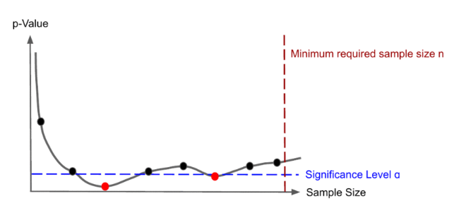

# Table of Content
- [Introduction](#introduction)
- [Topic 1: Sequential Testing and Peak in AB Testing](#topic-1-sequential-testing-and-peak-in-ab-testing)
- [Topic 2: Bandit vs. A/B Testing](#topic-2-bandit-vs-ab-testing)
# Introduction
Welcome to my repository, a personal notebook where I document my learning journey through A/B testing in the industry. This repository is shaped by the challenges and experiences I've encountered during my professional work. It is important to note that the materials and references here are curated based on what I have found to be most useful and relevant to my own learning, and may not comprehensively cover all the basic or advanced topics others might deem important. My goal is to provide a personal account and resource that supports my ongoing learning and development in the field of A/B testing. This repository is intended for those interested in seeing how A/B testing can be applied from a practical, experiential perspective.

# Topic 1: Peak in AB Testing and Sequential Testing 
**In traditional fixed-horizon A/B testing, the experiment's sample size are predetermined**. However, this approach often encounters the issue of "peeking," where experimenters check the ongoing results before reaching the predetermined endpoint. This behavior typically arises from the substantial opportunity costs associated with longer experiments. The ability to quickly detect significant effects or decide to abandon inconclusive tests in favor of more promising ones can be highly advantageous.

Peeking offers a practical benefit in modern A/B testing environments that provide real-time data access. It allows experimenters to dynamically trade off between maximizing detection power and minimizing sample size, adjusting their strategies based on early insights from the data. However, this approach also presents challenges:
- Lack of Prior Understanding: Many experimenters do not have a well-defined sense of their tolerance for the duration of experiments or the effect sizes they aim to detect. This lack of clarity can make it difficult to optimize the sample size from the outset.
- Statistical Risks: Theoretically, if an experimenter continuously monitors the p-values during an A/B test, the chance of incorrectly rejecting the null hypothesis (Type I error) increases as the monitoring period extends. Under the null hypothesis—that is, when there is no real effect—any fixed significance level ($\alpha$) can be inadvertently crossed simply by the act of waiting and watching the p-values over time.
The figure below illustrates how continuous monitoring of test statistics, or peeking, can artificially inflate the probability of refuting the null hypothesis despite there being no true underlying effect. This phenomenon highlights the need for careful consideration when designing and interpreting A/B tests, especially in environments where data is readily available.

## References
- Johari, R., Koomen, P., Pekelis, L., & Walsh, D. (2017). Peeking at A/B Tests: Why it matters, and what to do about it. Proceedings of the ACM SIGKDD International Conference on Knowledge Discovery and Data Mining, Part F129685, 1517–1525. https://doi.org/10.1145/3097983.3097992

# Topic 2: Bandit vs. A/B Testing
- [When You Should Prefer “Thompson Sampling” Over A/B Tests](https://medium.com/towards-data-science/when-you-should-prefer-thompson-sampling-over-a-b-tests-5e789b480458)
> This is a good blog to demostrate how Thompson Sampling works for ads click and provide distribution evolution over time. Very easy to understand.